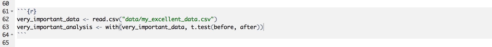

## Hello!

 

## Hello!

\Large Olivia (Rata) Burge 

\normalsize
\@oliviarata 

oliviarata.wordpress.com 

https://github.com/orb16


## R Markdown

This is an R Markdown presentation. Markdown is a simple formatting syntax for authoring HTML, PDF, and MS Word documents. For more details on using R Markdown see <http://rmarkdown.rstudio.com>.

When you click the **Knit** button a document will be generated that includes both content as well as the output of any embedded R code chunks within the document.

## Why R markdown?

- Allows you to combine your science with your analysis code. 
- This means: 

    - You won't forget which file/which version of the file you used
    - Analysis completley reproducible
    - You can even write documents with citations, italics, etc.
   
## Smaller benefits

- Good for annotating your analysis as you go
- Easy on the eyes 

## To include text in the document:

- Just type normally!
- Hashtags (\#) signify heading level
- To __bold__ a word or words, encase it/them in double underscores \__
- To italicise a word or words, encase it/them in single underscores \_.
- Lists - just use hyphens (or numbers)

## To include r code in the document

"Code chunks" are where you'll put the code. To make a chunk, you need code like this:
 
 

## Code chunk options

- ````{r eval = FALSE}` means the code will be printed but not run
- ````{r echo = FALSE}` means the code won't be printed, but the command will be run

## Using markdown documents today

- If you choose to use one, you can run all the code in the code chunks as you would in R (command-enter on macs, control-r on windows, or using the file menu).
- If you go up to the "Chunks" menu (top right) you'll see you can run all the chunks, just the current one (the one your cursor is in), etc. 
- But - if you prefer not to, no worries! Just copy and paste the text from the pdfs into your console or R script.  

## Using markdown documents - individual exercise

(1) Please go to file, new file, second option (R Markdown).
(2) Choose one of the document or presentation options.
(3) Have a look at the layout.
(4) Hit "Knit" (top middle of your screen).
(5) [Optional] modify as you wish and save it. 

