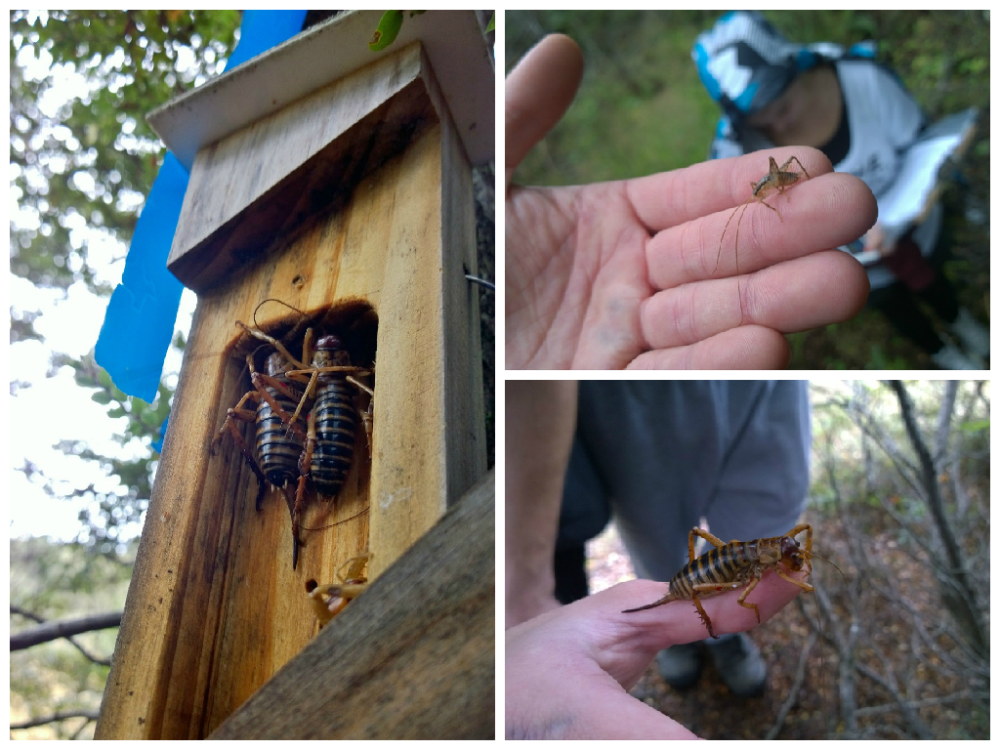

## Data manipulation

\center
 


## Session format 

\Large General structure 

1. Concept explanation 

2. Example code explanation 

3. Class exercise  

4. Individual task 

## Required background (1) 

I assume that you: 

- have the most up to date R & Rstudio installed
- know how to install and load packages
- know how to set your working directory
- know that you can work in the console or work in a script
- have a rough idea of what a factor is compared to a numeric variable (for example)

## Required background (2) 

I assume that you: 

- know what format a csv needs to be in to import it into R
- know that a dataframe is roughly equivalent to a .csv file
- can read in data using read.csv()
- know what an object is


## Key outcomes for session

\Large My aim is that you: 

\normalsize 

- __Understand__ `dataframe[ , ]` & `dataframe$column` notation 

- Can __subset__ dataframes with `filter()` and `select()`, and order them with `arrange()`

- Can __chain__ (aka pipe) commands using `%>%`

- Can __summarise__ dataframes, and summarise __grouped__ dataframes using `summarise` and `group_by()`

- Can __join__ dataframes using `inner_join` & `left_join`

- Can __manipulate the format__ of data (long-to-wide and wide-to-long) using tidyr
    

## Why dplyr and tidyr?

Actually a lot of options: 

- Various functions in base R
- data.table
- plyr/reshape2
- other packages

Benefits of dplyr: 

- __not__ speed (data.table can be worth it on big data)
- but __intuitive__


## Before we start: 

- No `attach()`  
- No `file.choose()`


## Data for today:

\center


## Data for today:

```{r, echo = T, results = 'hide'}
getwd()

weta_data <- read.csv("data/weta_270.csv")

```

## Square bracket notation - concept

- `Dataframe[ , ]` notation
- Dataframe[ rownumber, colnumber ] 
- Dataframe[ 3, 4] is equivalent to the excel reference cell D3


## Square bracket notation - examples

- Dataframe[ 2, 3] 
- Dataframe[ 1:5, c(5:7, 9)] 


```{r, echo = T, eval = F}
weta_data[ , 5] # fifth column

weta_data[5]    # fifth column 
#(not using this form today)

weta_data[ 2:4, ]
```


## Square bracket notation - class exercise

We've just been told that the "average.other.dbh" value in line 67 is wrong, and is actually 18.83. We don't change the raw data, but want to change in R before proceeding. 

1. Select the cell by using square bracket notation and print to screen (it should read 8.83)
2. Amend it using the assign (<-) function to 18.83

## Square bracket notation - class exercise - answers

```{r, eval = FALSE}
# checking which cell? (it should be 8.83)
weta_data[ 67, 8 ]

## changing the error to 18.83
weta_data[ 67, 8 ] <- 18.83

# checking that it has changed

weta_data[ 67, 8 ]

```

## Square bracket notation - individual exercise

You are interested in whether weta presence varies with distance to edge canopy cover. 

1. Assign the columns motel, weta.presence2, and canopy.cover to a new dataframe called "weta_dist"


## Square bracket notation - individual answers

```{r, results = 'hide'}
names(weta_data) # we want cols 14, 5, 7
weta_dist <- weta_data[ , c(1, 5, 7, 14)]

head(weta_dist, 2)
```


## Key base R knowledge (2)
- `Dataframe$column`

Same as selecting an entire column with the mouse in excel. 

e.g. 
```{r, eval = FALSE}
weta_dist$distance.to.edge

```

## Dollarsign notation - use case

You will often see it used to create variables quickly. We will cover this in dplyr too.

e.g. 
```{r, results = FALSE, tidy = TRUE}
weta_dist$distance.log <- log(weta_dist$distance.to.edge)
```

## Key base R knowledge: summary

We can use: 

(1) The square bracket notaton to select either rows, __or__ columns; and
(2) `Dataframe$column` notation to select columns. 

## Before we move on:

\begin{columns}[c] % the "c" option specifies center vertical alignment
\column{.5\textwidth} % column designated by a command 

\LARGE

- Questions?  

- Anyone unable to install and `require(dplyr)` or `require(tidyr)`? 

\normalsize

\column{.5\textwidth}
    \begin{block}{Enough weta} 
    \includegraphics[width=\textwidth]{figures/weta2.jpg}
    \end{block}

\end{columns}


## Subsetting dataframes 

\begin{block}{Manuka data} 
\includegraphics[]{figures/manuka.jpg}
\end{block}


## Subsetting dataframes 
```{r, results = "hide", warning=FALSE, message=FALSE}
require(dplyr)
require(tidyr)
manuka_data <- read.csv("data/manuka.csv")
head(manuka_data, 2)
```

## Select - concept
Select chooses certain columns - to keep, or to get rid of.
The format is 

`DATANAME %>% select(c(col1, col2, col3))` 

or 

`DATANAME %>% select(col1:col4)`

## Select - examples

```{r, eval = FALSE}
# we can also rename cols on the fly:
manuka_data %>% select(Plot = plotnumber, Age)

# selecting all cols between plotnumber and GW
manuka_data %>% select(c(plotnumber:GW))

# dropping columns
manuka_data %>% select(-c(Height:MV))
````

## What is this?  %>%  %>%  %>% 

\center


## What is this?  %>%  %>%  %>% 

Chaining allows us to write code in the order we want it done. Otherwise, it must be wrapped in brackets with the first thing to be done right in the middle. 

`manuka_data %>% select(c(Height, CO))`

means, take the manuka dataframe, and then select the columns Height and CO. 

## Filter - concept

Filter selects rows in your dataframe, based on the conditions you specify.  Same format as for `select()`:

`filter(DATA, CONDITION1)` 

 - row only selected if condition satisfied 

`filter(DATA, CONDITION1 & CONDITION2)` 

- both conditions must be satisfied 

`filter(DATA, CONDITION1 | CONDITION2)` 

- one or both conditions must be satisfied 


## Filter: examples

```{r, eval = FALSE}
levels(manuka_data$Site)
manuka_data %>% filter(Site == "Clearwater")
```
```{r, eval=FALSE}
manuka_data %>% filter(Age > 32)
manuka_data %>% filter(Age > 32 & Site == "Lawsons")
manuka_data %>% 
  filter(Age > 32 | ( Site == "Clearwater" & Age > 28 ))
````

## Arrange
`arrange(COLUMN)` orders the dataframe rows by the specified values

```{r, eval = FALSE}
manuka_data %>% arrange(CO)

#using desc() reverses the order
manuka_data %>% arrange(desc(CO))
manuka_data %>% arrange(desc(Site))
```

## Select, filter & arrange - class exercise

We create a new dataframe which contains only sites Clearwater and Tiwai, and only the columns Site, Height, Age. We arrange it by Age.

## Select, filter & arrange - class exercise
We need to add an extra step here.

```{r, eval = FALSE}
manuka_data %>% 
  filter(Site %in% c("Clearwater", "Tiwai")) %>% 
  select(Site, Height, Age)
```


## Select, filter & arrange - individual exercise

(1) Please create a dataframe with GW (groundwater) less than 50 and the columns CH and CO.

(2) Using the weta dataset, please select the rows which have either a cave weta (weta.cave) present, or more than two weta in total (total.weta). Please select the columns motel, total.weta.inclcave and canopy.cover, but rename motel to mansion. Please arrange it by mansion.

## Select, filter & arrange - individual exercise answers (1) 

```{r, eval = FALSE}

answer1 <- manuka_data %>% 
  filter(GW < 50) %>%
  select(CH, CO)
```


## Select, filter & arrange - individual exercise answers (2) 
```{r}
answer2 <- weta_data %>%
  filter(weta.cave == 1 | total.weta.inclcave > 2) %>%
  select(mansion = motel, 
         total.weta.inclcave, 
         canopy.cover) %>% 
  arrange(mansion)

```

## Creating new variables: mutate

We use mutate to create new variables (or columns) that are the same length as our existing dataset. For example, you may wish to:

- transform data (log, squareroot, etc)
- change the units (cm to km, or feet to miles)
- modify an existing variable based on another existing variable (e.g. height/age).


## Mutate - example code

We create a variable that converts height to height in centimetres, and then standardise it by age. We also create a column which takes the log of canopy openness (CO).

```{r, results = 'hide'}
manuka_data %>% 
  mutate(log_co = log(CO), 
         height_cm = Height * 100,
         height_age = height_cm/Age) %>%
  select(CO, log_co, Height, height_cm, Age, height_age)
```

## Mutate - class exercise

In the one dataframe: 

(1) Please firstly use filter to select only the records in which spiders were absent (spider.presence). 
(2) Please create a column which adds the number of cave weta (weta.cave) to the number of total weta (total.weta). 
(3) Please also create a column which is the DBH of the host tree divided by the DBH of surrounding trees (dbh.host divided by the average.other.dbh).

## Mutate - class exercise
```{r, results = 'hide'}
weta_data %>%
  filter(spider.presence == 0) %>%
  mutate(all_the_weta = weta.cave + total.weta,
         dbh_index = dbh.host/average.other.dbh) 
```

## A short break

\includegraphics[]{figures/wetland.jpg}


## Summarising - concept

Summarising data means taking various statistics of the existing dataframe. When used by itself, `summarise` returns a statistic which you have chosen, with a name of your choosing.

`data %>% summarise(NEWNAME = FUNCTION(COLUMN))`

## Summarising by group - concept

Summarising by group returns one summary statistic for each group, rather than for the entire column.  We use the `group_by` command to tell R which column we want to group on.

Format:

```{r, eval=FALSE}
data %>%
group_by(COLUMN) %>%
summarise(NEWNAME = FUNCTION(COLUMN))
```

## Summarising, and summarising by group - examples (1)

```{r, eval = FALSE}
manuka_data %>% 
  summarise(mean_age = mean(Age),
            n = n())

manuka_data %>% 
  group_by(Site) %>%
  summarise(mean_age = mean(Age))

```

## Summarising, and summarising by group - examples (2)

```{r, eval = FALSE}

manuka_summarise <- manuka_data %>% 
  group_by(Site) %>%
  summarise(mean_age = mean(Age),
            se_age = sd(Age)/sqrt(length(Age)),
            mean_CO = mean(CO),
            se_CO = sd(CO)/sqrt(length(CO)),
            min_MV = min(MV))

write.csv(manuka_summarise, 
          file = "data/manuka_summarise.csv",
          row.names = FALSE)
```

## Summarising: group exercise
In one dataframe: 

(1) Please calculate the mean canopy cover for all motels.

In another dataframe: 

(1) Calculate the mean canopy cover for motels with and without weta present (weta.presence). 
(2) Please also report the number of observations per group.

## Summarising: group exercise

```{r, eval = FALSE}
weta_data %>% summarise(mean_cc = mean(canopy.cover),
                        n = n())

weta_data %>% group_by(weta.presence) %>% 
  summarise(mean_cc = mean(canopy.cover), 
            n = n())
```

## Summarising: individual exercise

(1) Please calculate the mean and standard deviation of the distance to edge, grouped by the number of cave weta (cave.weta.presence) in motels.  

(2) Please also report the number of observations per group. 

## Summarising: individual exercise - answers

```{r, eval = FALSE}
weta_data %>% 
  group_by(cave.weta.presence) %>%
  summarise(mean_weta = mean(total.weta),
            sd_weta = sd(total.weta),
            n_obs = n())
```


## Slicing

Slice:  

(1) `slice(1)` slices the first occurence. 
(2) `slice(1:3)` slices the first three instances. 

More useful than you might think. 

```{r, results = 'hide', message=FALSE, comment=FALSE, warning=FALSE}
require(lme4)
require(datasets)
data(sleepstudy)
head(sleepstudy)

# what is the minimum reaction time for each person?
sleepstudy %>% group_by(Subject) %>% 
  summarise(min_reaction = min(Reaction))

```

## Slicing cont.

But what if we want to know what is the minimum reaction person after day 3, taking the later day if days are tied (same reaction time)?

```{r, eval=FALSE}
sleepstudy %>% 
  filter(Days > 3) %>% 
  group_by(Subject) %>% 
  arrange(Reaction, desc(Days)) %>%
  slice(1)
```

## Joining

Joining allows us to combine two dataframes into one. Useful for analysis and plotting. dplyr has a number of joins available, depending on what you want to do. 

In ecology, this often occurs where we have __environmental data for each plot__ and also __species data__, and the species data may be a different length to the plot data. 

## Joining - data

Please read in the following data:

```{r, results = "hide"}
species_270 <- read.csv("data/veg_species.csv")
env_270 <- read.csv("data/veg_environment.csv")

head(species_270)
head(env_270)
glimpse(species_270)
glimpse(env_270)

````

## Quick break

\center


## Joining - example code

Have a look at `?inner_join` for all examples. We will need an example which returns all the species rows, but duplicates the environmental variables where necessary. So we'll use `left_join`.

````{r, eval = FALSE}
left_join(x = DATA1, y = DATA2)
left_join(x = DATA1, y = DATA2, by = JOINING_VAR)
```

## Joining - class exercise
We are joining the species data (1008 rows = 36 sites * 28 species) to the environmental data (36 rows = 1 per site).

```{r, results = 'hide'}
combined_270 <- left_join(species_270, env_270)

combined_270 %>% group_by(species, site) %>% 
  summarise(mean_cover = mean(cover),
            min_cover = min(cover),
            max_cover = max(cover)) %>%
  ungroup() %>%
  group_by(site) %>%
  arrange(desc(mean_cover)) %>%
  slice(1:3)

```

## Changing the format of data

It is generally recommended to have data in 'long form' in R (the form in which the species data was in). However, sometimes we may want it in wide form, particularly for ordinations.

\Large Key terms: 

\normalsize 

(1) __Key__ is the variable that describes the group (e.g. "species") 

(2) __Value__ is the variable which describes what you've measured (e.g. "cover", or "proportion_alive", etc)  


## Data format - example code (1)

To go from long-to-wide, we use `spread()`

```{r, results = 'hide'}
head(species_270)
species_270_wide <- species_270 %>% 
  spread(key = species, value = cover)
head(species_270_wide)
```


## Data format - example code (2)

To go from wide-to-long, we use `gather()`
```{r, results = 'hide'}
weta_wide <- weta_data %>% 
  select(motel, 
         weta_tree = weta.presence2, 
         weta_cave = cave.weta.presence,
         spider = spider.presence, 
         cockroach = cockroach.presence)
head(weta_wide)

weta_long <- weta_wide %>% 
  gather(key = species, 
         value = presence, 
         weta_tree:cockroach)
head(weta_long)
````

## Data format - individual exercise

(1) Please read in the mites dataset (from package vegan, with one amendment) 
```{r, results = 'hide'}
mites <- read.csv("data/vegan_mites.csv")
head(mites)
```

(2) Please turn the data from wide format (currently) to long format. Please call the columns 'species' and 'count'. 

(3) Please summarise by species the mean count.

(4) Please select the 10 most numerous species, based on mean count. 


## Data format - individual exercise - answers (1)

- Please turn the data from wide format (currently) to long format. Please call the columns ‘species’ and ‘count’ 


```{r, eval = FALSE}

mites_wide <- mites %>% 
  gather(key = species, 
         value = count,
         Brachy:Trimalc2)
head(mites_wide)
```

## Data format - individual exercise - answers (2)

```{r, eval = FALSE}
# Please summarise by species the mean count 

mites_wide %>% 
  group_by(species) %>% 
  summarise(mean_count = mean(count))
```


## Data format - individual exercise - answers (3)

- Please select the 10 most numerous species, based on mean count. 
- This requires us to arrange by mean_count (descending order, then slice the top ten)

```{r, eval = FALSE}
mites_wide %>% 
  group_by(species) %>% 
  summarise(mean_count = mean(count)) %>%
  arrange(desc(mean_count)) %>%
  slice(1:10)
```

## And now

\Huge Questions?

## Thank you 

\center
 

## Want to share/use/improve?

\Huge Please do!

\normalsize

This work is licensed under the Creative Commons Attribution-NonCommercial-ShareAlike 4.0 International License. To view a copy of this license, visit http://creativecommons.org/licenses/by-nc-sa/4.0/.
