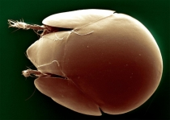
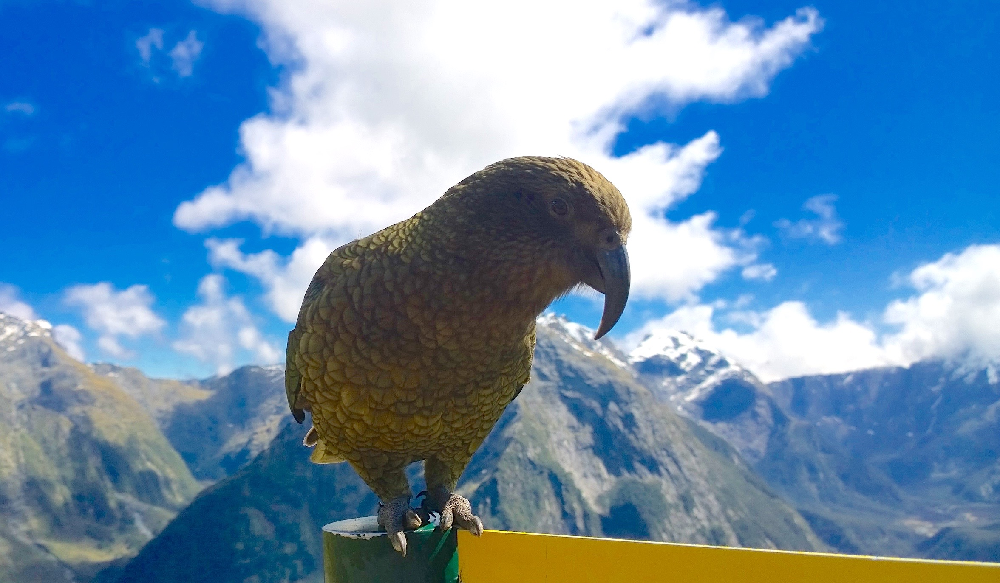

## Introduction

Overview for this afternoon's session:

(1) Introduction to ggplot
    (a) Basic plots
    (b) Changing linetype; colour; fill by factor
    (c) Facetting
    (d) Customising legends and labels 
(2) Visualising correlations - ggpairs 
(3) Plotting model output - ggplot and coefplot2()
(4) More if we have time: mapping (or ordinations)

## Packages required

Please either install (`install.packages("package")`) or update (same command) the following packages:

(1) ggplot2
(2) ggthemes
(3) wesanderson
(4) GGally (for ggpairs)
(5) coefplot2() (**)
(6) effects
(7) vegan
(8) gridExtra

** coefplot2 will probably only work is you use: `install.packages("coefplot2",
repos = "http://www.math.mcmaster.ca/bolker/R", type="source")`
    

## The main graphics systems in R:

1. Base graphics (built-in)
2. Lattice (package)
3. ggplot2 (package)
4. ggvis (http://ggvis.rstudio.com/ggplot2.html)

## Data

```{r, echo = T, results = 'hide', message=FALSE, warning = FALSE}
getwd()
# setwd()

manuka_data <- read.csv("data/manuka.csv")
weta_data <- read.csv("data/weta_270.csv")
require(ggplot2)
require(dplyr)
theme_set(theme_bw())
```

## Scatter plot

```{r}
ggplot(data = manuka_data, aes(x = Height, y = Age)) +
  geom_point()
````

## Boxplot 

```{r}
ggplot(data = manuka_data, aes(x = Site, y = Age)) +
  geom_boxplot()
````

## Histogram 

```{r}

ggplot(data = manuka_data, aes(x = Age)) +
  geom_histogram()
````


## Bar Plot 

```{r}
#generate data
bar_data <- data.frame("Ht" = rpois(4, 5), 
                       'Species'= c('A','B','C','D'))

ggplot(data = bar_data, aes(x = Species, y = Ht)) + 
  geom_bar(stat="identity")
```

## Line Plot ##

```{r}
#generate data
line_data <- data.frame('Days'=1:7, 
                        'Productivity'= rnorm(7, 50, 10))

ggplot(data = line_data, 
       aes(x = Days, y = Productivity)) + 
  geom_line()
```

## Basic plots: individual exercise

(1) Please create a scatter plot of soil moisture (MST) and conductivity (MV)
(2) Please create a boxplot of manuka height (Height) by site
(3) Please create a bar graph of mean manuka age (Age) by site

## Basic plots: individual answers

```{r, eval = FALSE}
# scatter plot MST and MV
ggplot(manuka_data, aes(x = MST, y = MV)) +
  geom_point()

# boxplot height and site
ggplot(manuka_data, aes(x = Site, y = Height)) +
  geom_boxplot()
```

## Bar graph answer & a quick note about 'stat ='

```{r, eval = FALSE}
ggplot(manuka_data, aes(x = Age)) +
  geom_bar(stat = "bin")

ggplot(manuka_data, aes(x = Site, y = Age)) +
  geom_bar(stat = "identity")
           
ggplot(manuka_data, aes(x = Site, y = Age)) +
 stat_summary(fun.y = "mean", geom = "bar") 
```

## Bar graph answer & a quick note about 'stat ='

```{r, results = 'hide', fig.keep='none'}
manuka_means <- manuka_data %>% 
  group_by(Site) %>%
  summarise(mean_age = mean(Age), 
            sd_age = sd(Age))


ggplot(manuka_means, aes(x = Site, y = mean_age)) +
   geom_bar(stat = "identity",
           fill = "white",
           colour = "black") +
     geom_errorbar(aes(ymin = mean_age - sd_age, 
                    ymax = mean_age + sd_age),
                width = 0.2, colour = "cornflowerblue") +
       scale_y_continuous(expand=c(0, 0), 
                          limits = c(0, 35))+
  theme_classic()
```

## Changing size of geoms (1)
```{r}
ggplot(data = manuka_data, aes(x = Height, y = Age)) +
  geom_point(size = 8)
```

## Changing size of geoms (2)
```{r}
ggplot(data = line_data, 
       aes(x = Days, y = Productivity)) + 
  geom_line(size = 5)
```

## Changing other variables of geoms (1)
```{r}
ggplot(data = manuka_data, aes(x = Height, y = Age)) +
  geom_point(size = 7, alpha = 0.5, 
             colour = "black", fill = "royalblue", 
             shape = 21)

```

## Changing other variables of geoms (2)
```{r}
ggplot(data = line_data, 
       aes(x = Days, y = Productivity)) + 
  geom_line(size = 1.5, linetype = "dashed",
            colour = "red2")
```

## Changing geoms by factor (1)

```{r, results = 'hide', message=FALSE, warning=FALSE}
require(vegan)
data(mite)
data(mite.env)
mite_all <- cbind(mite, mite.env)

ggplot(data = mite_all, aes(y = Brachy, x = WatrCont)) +
  geom_point(aes(colour = Shrub, shape = Shrub), 
             size = 3) 

```

## Changing geoms by factor (2)

```{r}
ggplot(data = mite_all, aes(y = Brachy, x = WatrCont)) +
  geom_point(aes(colour = SubsDens), size = 3) 

```

## Changing geoms by factor (3) 

```{r}
ggplot(data = mite_all, aes(y = Brachy, x = WatrCont)) +
  geom_point(aes(colour = Shrub, shape = Shrub), 
             size = 3) +
  scale_colour_manual(values = c("forestgreen", 
                                 "orange", 
                                 "royalblue")) +
  scale_shape_manual(values = c(8, 18, 3))
```

## Changing geoms by factor (4)

```{r}
ggplot(data = mite_all, aes(y = Brachy, x = WatrCont)) +
  geom_point(aes(colour = SubsDens), size = 3) +
  scale_colour_gradient(low = "orange", high = "black")
```

## Individual exercises

(1) Please create a histogram of weta abundance (total.weta), with a black outline and grey fill.

(2) Please create a scatter plot the abundance of NCOR mites ("NCOR") against substrate density (SubsDens). Please colour by topo type ("Topo") and change the size by shrub type ("Shrub"). Please use the classic theme (`theme_classic()`). 

## Questions so far? 
\center
 

\tiny Photo credit: http://www.senckenberg.de/root/index.php?page_id=14691

## GGPAIRS

- Useful for visualising correlations
- Not as intuitive to customise
- Slower than `pairs()` but more features

```{r, message=FALSE, warning=FALSE}
require(GGally)
```

## GGPAIRS: example

```{r, message=FALSE, warning=FALSE, fig.keep='last', eval = FALSE}

manuka_data %>% 
  select(Height, Age, MV, CO) %>% 
  ggpairs()

ggpairs(manuka_data[ , c("Height", "Age", "MV", "CO")])
```

## GGPAIRS: example
```{r, echo = FALSE, message= FALSE, warning=FALSE}

ggpairs(manuka_data[ , c("Height", "Age", "MV", "CO")])
```

## Compared to pairs: example

```{r, message=FALSE, warning=FALSE, fig.keep='last', eval = FALSE}
manuka_data %>% 
  select(Height, Age, MV, CO) %>% 
  pairs()

pairs(manuka_data[ , c("Height", "Age", "MV", "CO")])
```

## Compared to pairs: example
```{r, echo = FALSE, message= FALSE, warning=FALSE}
pairs(manuka_data[ , c("Height", "Age", "MV", "CO")])
```

## GGPAIRS: example with factor

```{r, message=FALSE, warning=FALSE, eval = FALSE}
manuka_data %>% 
  select(Height, Age, MV, CO, Site) %>% 
  ggpairs(colour = "Site")

ggpairs(manuka_data[ , c("Height", "Age", "MV", 
                         "CO", "Site")], 
        colour = "Site")
```
## GGPAIRS: example with factor

```{r, echo = FALSE, message= FALSE, warning=FALSE}

ggpairs(manuka_data[ , c("Height", "Age", "MV", 
                         "CO", "Site")], 
        colour = "Site")
```


## GGPAIRS: individual exercise

(1) Please use the mite.env data and create a ggpairs plot of SubsDens, WatrCont, coloured by Topo type.

## GGPAIRS: individual exercise - answer

```{r, message=FALSE, warning=FALSE, eval = FALSE}
mite.env %>% 
  select(SubsDens, WatrCont, Topo) %>% 
  ggpairs(colour = "Topo")

ggpairs(mite.env[ , c("SubsDens", "WatrCont", "Topo")], 
        colour = "Topo")
```


## Questions?


## Plotting model outputs - concept

\LARGE Model done - now what?

 Two options:
 
 (1) Plot the coefficients; or 
 
 (2) Plot the predicted values for the treatment effects
 
## Data & model

```{r}
mite_brachy <- mite_all %>% 
  select(Brachy, SubsDens, Shrub)

mod1 <- glm(data = mite_brachy,
            formula = Brachy ~ SubsDens * Shrub,
            family = poisson)
```

 
## Data & model
```{r, eval = FALSE}
require(coefplot2)
coefplot2(mod1)
```

## Data & model
```{r, results = 'hide', message = FALSE, warning= FALSE}
mite_new1 <- expand.grid(
  SubsDens = seq(from = min(mite_brachy$SubsDens), 
                 to = max(mite_brachy$SubsDens), 
                 by = 1), 
  Shrub = levels(mite_brachy$Shrub))

mite_new2 <- cbind(mite_new1, 
                   predict(mod1, 
                           newdata = mite_new1, 
                           type = "link", se = TRUE))
# the se.fit (untransformed se) and 
# the residual scale (we are not using this).
```

## Data & model

```{r}
# next, within the dataframe we just created, 
# we do create new columns:
mite_new2 <- within(mite_new2, {
    #back tranformation to the response scale
  transformed_response <- exp(fit) 
    #backtransforming the SE
  lower_CI <- exp(fit - (1.96 * se.fit)) 
  upper_CI <- exp(fit + (1.96 * se.fit))
})
```

## Data & model

```{r, message=FALSE, warning=FALSE}
# to plot the results:
mite_new2$Shrub2 <- factor(
  mite_new2$Shrub,
  levels = levels(mite_new2$Shrub),
  labels = paste("Shrubs", 
                 tolower(levels(mite_new2$Shrub)), 
                 sep = ": "))
```

## Data & model
```{r, results = 'hide'}
predicted_brachy <- ggplot(mite_new2, 
                           aes(x = SubsDens, 
                               y = transformed_response))+
  geom_line() +
  geom_ribbon(aes(ymin = lower_CI, 
                  ymax = upper_CI), alpha = 0.3)+
  labs(y = expression(paste("Predicted ", 
                            italic("B. armetelius "),
                            "abundance")), 
       x = "Substrate density")+
  facet_wrap(~Shrub2) +
  theme_bw()
```

## Predictions: figure 

```{r}
predicted_brachy
```

## Parrots

\center
 

## Maps

Some packages required
```{r, message = FALSE, warning= FALSE, comment=FALSE}
require(mapdata)
require(maps)
require(wesanderson)
require(ggplot2)
require(ggthemes)
```

## Data - base map

```{r}
nz_data <- map_data("nzHires")
nz_map <- fortify(nz_data)
nz_data <- nz_data[nz_data$region %in% c(
  "North Island", "South Island"),]
```

## Data - species occurences

```{r}
kaka_data <- read.csv("data/kaka.csv")
parrot_data <- read.csv("data/parrot.csv")
```
## Parrot observation quality 

```{r, message= FALSE, warning=FALSE, eval = FALSE}
ggplot() +
  geom_path(data = nz_data, 
            aes(x = long, 
                y = lat, 
                group = group)) +
  geom_point(data = kaka_data[ !is.na(kaka_data$latitude), ], 
             aes(x = longitude, 
                 y = latitude, 
   colour = quality_grade),
    size = 3, 
    alpha = 0.8) +
  coord_map() +
  theme_minimal()
```

## Parrot distributions

```{r}
parrotmap <- ggplot() +
  geom_path(data = nz_data, 
            aes(x = long, y = lat, 
                group = group)) +
  geom_point(data = parrot_data, 
             aes(x = longitude, y = latitude,
                 colour = species),
             size = 3, alpha = 0.8) +
  scale_colour_manual(name = "Species", 
                      values = wes_palette(
                        "GrandBudapest"))+
  coord_map() +
  theme_minimal()+
  theme(legend.key = element_blank())

```

## Parrot map

```{r}
parrotmap
```

## The end

\Huge 
Thanks very much!

\Large 
\@oliviarata (twitter) 

oliviarata.wordpress.com 

http://github.com/orb16 

Or come to the poster session :) 

## Want to share/use/improve?
Please do!

This work is licensed under the Creative Commons Attribution-NonCommercial-ShareAlike 4.0 International License. To view a copy of this license, visit http://creativecommons.org/licenses/by-nc-sa/4.0/


